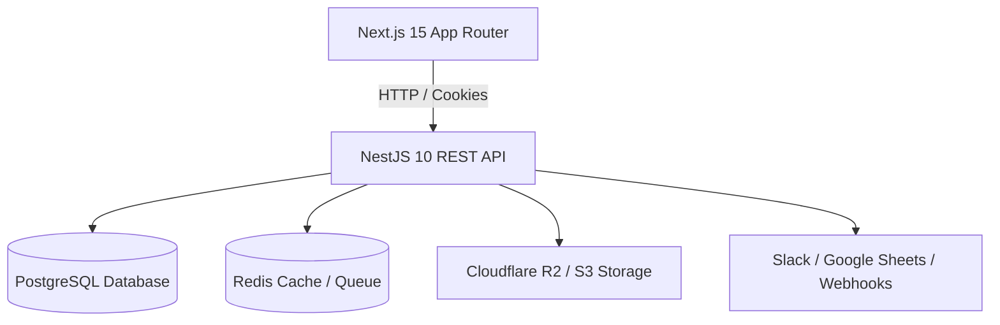

# Cogniform — Platform Architecture Documentation

## Architecture Overview

Cogniform is built as an enterprise-grade form management monorepo powered by **Turborepo**, **pnpm**, **NestJS**, **Next.js 15 App Router**, and **Prisma ORM**.

## System Components

### 1. Next.js 15 App Router Web App (`apps/web`)
- **Route Guard Middleware**: Route protection interceptor checking JWT cookies.
- **State Management**: Zustand auth store & workspace state.
- **Form Builder**: 3-column interactive builder supporting 17 field types from `@cogniform/utils`.
- **Analytics Dashboard**: Recharts visualization rendering views, submissions, conversion rates, and device distribution.

### 2. NestJS 10 REST API Server (`apps/api`)
- **Authentication**: JWT access & refresh tokens in `httpOnly` cookies with Argon2 password hashing.
- **RBAC Guard**: Enforces workspace permission hierarchy (`OWNER` > `ADMIN` > `EDITOR` > `VIEWER`).
- **Prisma Service**: Type-safe database interactions mapping 16 database models.
- **Audit Logger**: Centralized action logging across all workspace resources.

### 3. Shared Workspace Packages (`packages/`)
- `@cogniform/types`: TypeScript interfaces and schema types.
- `@cogniform/utils`: Field type registries, evaluation engine, and conversion math helpers.
- `@cogniform/validation`: Zod validation schemas.
- `@cogniform/ui`: Reusable shadcn UI design component library.
